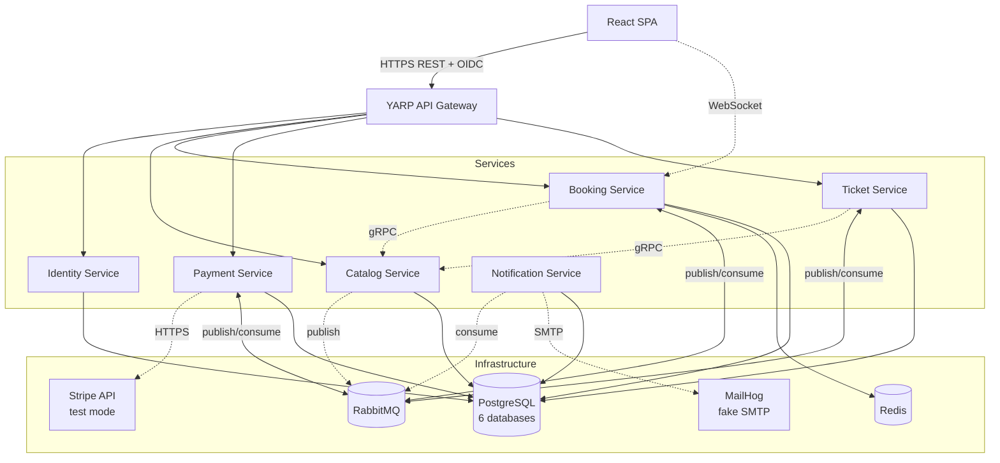
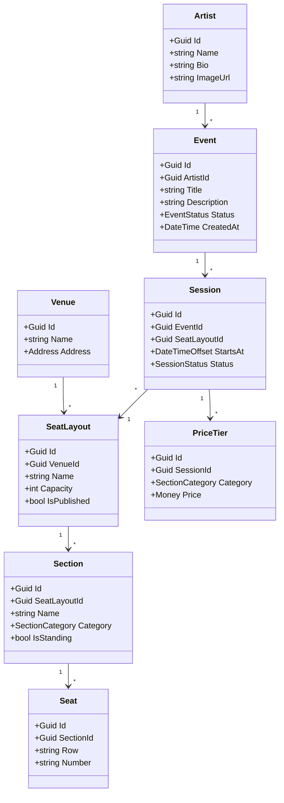
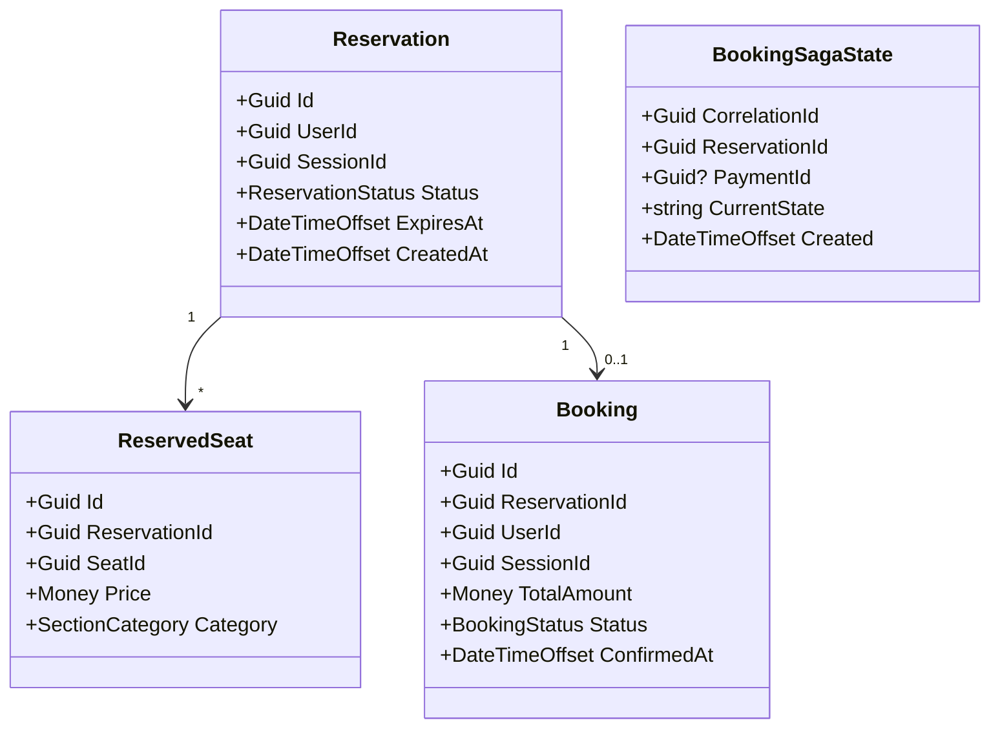
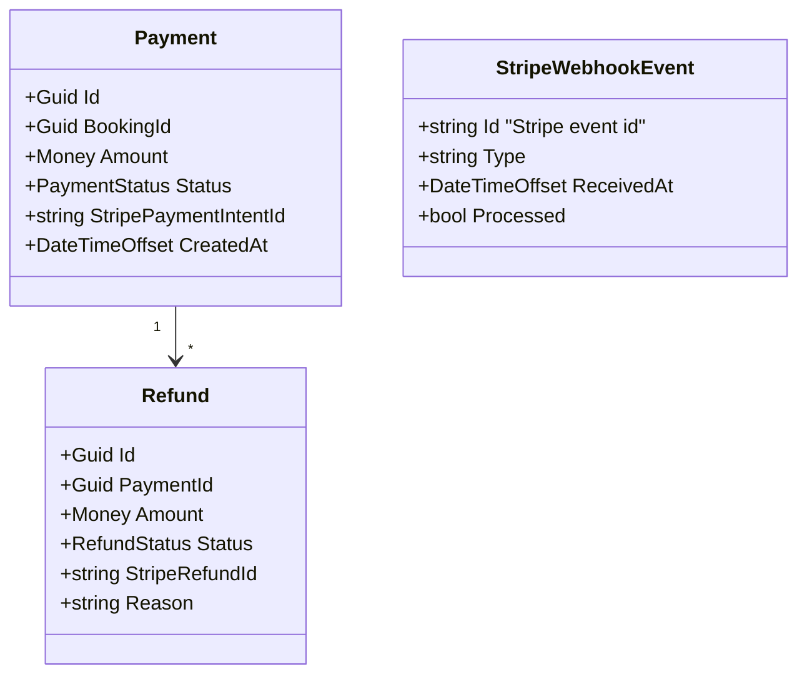
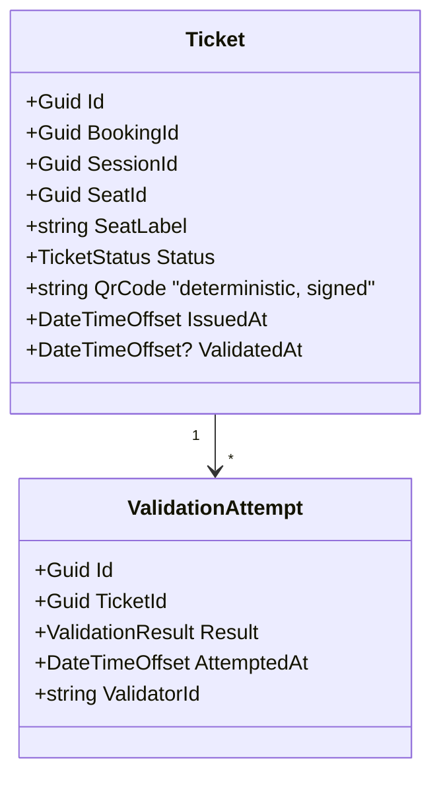
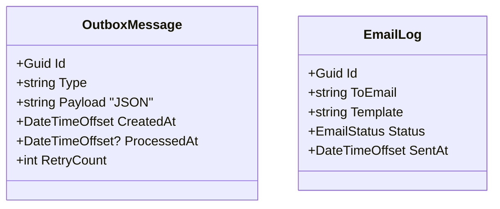
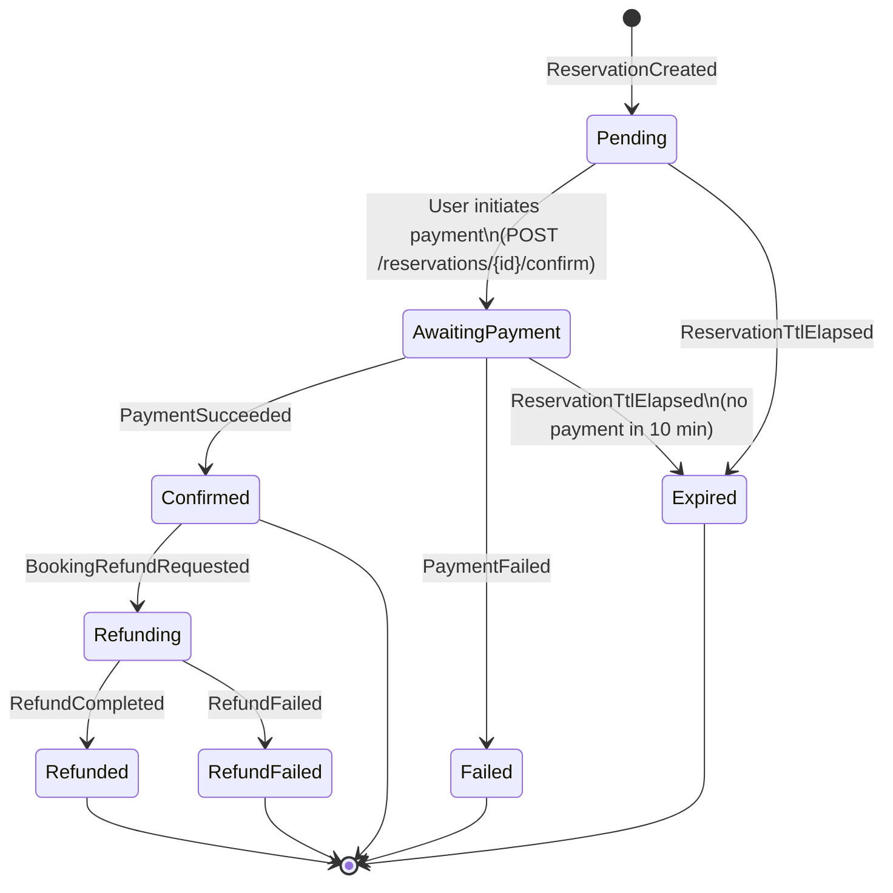

# Eventify — Architecture

> **Eventify** is a microservices ticket-booking platform for concerts and live shows.
> This document is the single source of truth for architectural decisions and is updated as the system evolves.
>
> Status: **Draft v1.0** — locked-in for MVP and Iteration 2. Sections marked `[evolves]` will grow per iteration.

---

## Table of Contents

1. [Overview & Goals](#1-overview--goals)
2. [Glossary](#2-glossary)
3. [Bounded Contexts & Service Map](#3-bounded-contexts--service-map)
4. [Service Catalog](#4-service-catalog)
5. [Domain Model (per service)](#5-domain-model-per-service)
6. [Communication Patterns](#6-communication-patterns)
7. [Booking Saga](#7-booking-saga)
8. [Cross-cutting Concerns](#8-cross-cutting-concerns)
9. [Tech Stack & Decisions](#9-tech-stack--decisions)
10. [Frontend Architecture](#10-frontend-architecture)
11. [Repository Structure](#11-repository-structure)
12. [Database Strategy](#12-database-strategy)
13. [Deployment](#13-deployment)
14. [Testing Strategy](#14-testing-strategy)
15. [Security](#15-security)
16. [Iteration Roadmap](#16-iteration-roadmap)
17. [ADR Index](#17-adr-index)

---

## 1. Overview & Goals

### What we're building

A ticket booking platform for **concerts and live shows** where users:
1. Browse events and pick a session (date/time/venue).
2. View an interactive seat map with real-time availability (SignalR).
3. Reserve seats with a 10-minute hold (TTL).
4. Pay via Stripe (test mode) using a real PaymentIntent + webhook flow.
5. Receive QR-coded tickets by email.
6. Get tickets validated at the venue entrance (mock validator endpoint).

### Why microservices

This is a **portfolio learning project** designed to demonstrate middle-senior level competence in:
- Distributed systems patterns (Saga, Outbox, Idempotency, CQRS where natural).
- Three styles of inter-service communication (REST for external, gRPC for internal sync, RabbitMQ for async).
- Observability (distributed tracing, metrics, structured logging).
- DevOps maturity (Docker Compose, Kubernetes manifests, GitHub Actions).
- Domain-driven design with proper bounded contexts.
- OAuth2 / OIDC (Duende IdentityServer).

This is **not** a system designed for production scale. Architectural decisions trade away production-grade complexity (multi-region, blue-green, etc.) in favor of clarity and learning surface.

### Non-functional targets (for demo purposes)

| Concern | Target |
|---|---|
| Throughput | 100 concurrent seat reservations per second on a single laptop |
| Latency | p95 booking confirmation < 1 s after payment success |
| Availability (local) | All services running on 16 GB RAM with Docker Compose |
| Consistency | Eventual between services (async events); strong within a single service (DB transactions) |
| Security | OAuth2/OIDC; PCI scope minimized via Stripe-hosted card capture |

### Personas

- **Customer (User role)** — browses events, books tickets, pays, receives tickets.
- **Admin (Admin role)** — manages catalog (events, venues, seat layouts, sessions, prices), views all bookings, triggers manual refunds.
- **Validator (mock)** — single endpoint for QR-code validation at entry. Authenticated via API key in MVP.

### Out of scope (deliberately)

| Feature | Reason for exclusion |
|---|---|
| B2B Organizer portal | Out of scope; would inflate auth and multi-tenancy complexity |
| Resale / secondary market | Not a microservices teaching topic |
| Reviews / ratings | Pure CRUD, no architectural value |
| Wishlists / favorites | Same |
| ML recommendations | Separate domain unrelated to messaging/saga focus |
| Multi-currency | USD only |
| Mobile apps | Web-only |

### In scope: bilingual UI (EN + UK)

The user-facing surfaces are localized in **English and Ukrainian**. This is not deferred polish —
`en` and `uk` keys ship in the **same PR** as the feature that introduces them.

| Surface | Mechanism |
|---|---|
| React SPA | i18next; `en/common.json` + `uk/common.json` |
| Identity Server Razor Pages | ASP.NET Core localization; `Captions.resx` + `Captions.uk-UA.resx` via `IStringLocalizer` |

Ukrainian is labelled **UK** (ISO 639-1 language code) in every switcher — never "UA", which is a
country code.

**Known gap:** server-side validation errors currently return pre-formatted English strings, so the
SPA cannot localize them independently. Carrying machine-readable codes + placeholder values
through `ValidationBehavior` is tracked as US-8.6 in `TASKS.md` — it was deferred from Phase 1
because Razor Pages render validation messages under each field, where the English string was
sufficient.

Localization applies to **UI text only**. Domain data (event titles, artist names, venue names)
remains single-language as entered by the Admin; multi-language *content* is out of scope.

---

## 2. Glossary

The vocabulary every developer (and document) on this project MUST use consistently.

| Term | Definition |
|---|---|
| **Event** | A live performance bookable on the platform (e.g., "Coldplay World Tour Kyiv 2026"). Belongs to one Artist. Has one or more Sessions. |
| **Artist** | The performer(s) headlining an Event. Simple aggregate (name, bio, image). |
| **Venue** | Physical location where Sessions take place (e.g., "NSC Olimpiyskiy"). Has one or more SeatLayouts. |
| **SeatLayout** | A configuration of a Venue (sections, rows, seats, capacity). One Venue can have multiple layouts (concert vs sports vs theatre setup). Immutable once published. |
| **Section** | A logical group of seats within a SeatLayout (e.g., "VIP", "Floor", "Balcony A"). Has a category that defines which PriceTier applies. |
| **Seat** | A specific seat in a Section (row + number) **or** a "general admission" slot in a standing area. Has a stable seat ID per layout. |
| **Session (a.k.a. Show)** | A scheduled instance of an Event at a specific Venue + SeatLayout on a specific date/time. Pricing is set per Session per SectionCategory. |
| **PriceTier** | The price for a SectionCategory in a Session (e.g., for session X: VIP=$200, Standard=$80, Standing=$40). |
| **Reservation** | A temporary hold on one or more seats for a Session, owned by a User, with a TTL (default 10 min). Prevents others from booking the same seats. |
| **Booking** | A confirmed Reservation that has been paid for. Generates Tickets. Has lifecycle: `Pending → Confirmed → Refunded/Cancelled`. |
| **Ticket** | A QR-coded entitlement to attend a Session for a specific Seat. Belongs to a Booking. Has state: `Issued → Validated` (or `Revoked` after refund). |
| **Payment** | A transaction processed via Stripe representing payment for a Booking. Tracked independently of Booking for audit. |
| **Refund** | A reversal of a Payment, fully or partially, that releases the corresponding seats and revokes the corresponding tickets. |
| **Saga** | The orchestration of the cross-service workflow `Reserve → Pay → Confirm/Compensate` using MassTransit StateMachine. |
| **Outbox** | A pattern where domain events are written to a local table in the same DB transaction as state changes, then published to RabbitMQ asynchronously. Guarantees "at-least-once" publishing. |
| **Integration Event** | A message published on RabbitMQ for cross-service consumption. Past tense, immutable, contains a stable schema. (vs. Domain Event = within a single service.) |

---

## 3. Bounded Contexts & Service Map

### High-level view



### Why this decomposition

- **Identity** owns auth — separated for OIDC compliance and to keep auth concerns reusable.
- **Catalog** is read-heavy and rarely changes — separated to scale independently and to demonstrate CQRS-friendly read paths (Postgres FTS, materialized views).
- **Booking** is the heart and most contention-prone component (race conditions on seats, seat-hold TTL) — isolated to manage its own consistency, distributed locks, and the Saga.
- **Payment** wraps Stripe and is the only service in PCI-adjacent scope — isolated to minimize compliance surface.
- **Ticket** has a different lifecycle from Booking (tickets exist after a booking confirms, are validated independently, can be revoked on refund). Separation lets ticket validation scale on its own.
- **Notification** is async-only and crosscutting — separated so business services don't couple to email/SMS infrastructure.

### Anti-patterns avoided

| Anti-pattern | Mitigation |
|---|---|
| Shared database between services | Each service has its own logical database; no cross-DB queries; data sharing only via gRPC or events |
| Distributed transactions (2PC) | Use Saga pattern with compensating actions instead |
| Tight coupling via shared library models | `IntegrationEvents` is a separate, versioned contract package; service-internal models are not shared |
| Synchronous chains across services | Booking → Payment is async via Saga; only "small look-ups" are sync (gRPC) |
| Spreading transactions over RabbitMQ + DB | Use Outbox pattern in every publishing service |

---

## 4. Service Catalog

Each service follows the same template: responsibility, ownership, public APIs (sync and async), dependencies, scaling notes.

### Port assignments (local development)

| Service | Port | Notes |
|---|---|---|
| **Gateway (YARP)** | **5000** | Only public-facing entry point; all SPA traffic goes through here |
| Identity | 5001 | Browser navigates directly during OIDC flows |
| Catalog | 5002 | |
| Booking | 5003 | |
| Payment | 5004 | |
| Ticket | 5005 | |
| Notification | 5006 | |

In Docker Compose only the Gateway exposes a host port (5000). All other services communicate over the internal Docker network by service name (e.g., `catalog-api:5002`). Identity is also directly accessible from the browser in development for OIDC redirects.

### 4.1 Identity Service

| Property | Value |
|---|---|
| **Owns** | Users, Roles, Refresh Tokens, OIDC clients/scopes |
| **Tech** | ASP.NET Core 10 + Duende IdentityServer 7 + ASP.NET Identity for user store |
| **Architecture style** | Clean Architecture (high importance, multi-aggregate) |
| **DB** | `eventify_identity` (Postgres) |
| **Public sync API** | OIDC endpoints (`/connect/token`, `/connect/authorize`, `/connect/userinfo`, `.well-known/openid-configuration`); Admin REST for user mgmt |
| **Public async (publishes)** | `UserRegisteredIntegrationEvent`, `UserDeletedIntegrationEvent` |
| **Async (consumes)** | — |
| **Dependencies** | Postgres only |
| **Scaling** | Stateless; horizontal scale OK; signing keys in shared key ring |

### 4.2 Catalog Service

| Property | Value |
|---|---|
| **Owns** | Artists, Events, Venues, SeatLayouts, Sections, Seats (definitions), Sessions, PriceTiers |
| **Tech** | ASP.NET Core 10 + EF Core 10 + Npgsql |
| **Architecture style** | Clean Architecture (rich domain) |
| **DB** | `eventify_catalog` (Postgres) |
| **Public sync API** | REST: `GET /events`, `GET /events/{id}`, `GET /sessions/{id}`, `GET /sessions/{id}/seats`; Admin REST for CRUD; gRPC for inter-service: `GetSessionDetails(sessionId)`, `GetSeatLayout(sessionId)`, `ValidateSeats(sessionId, seatIds)` |
| **Public async (publishes)** | `SessionPublishedIntegrationEvent`, `SessionCancelledIntegrationEvent`, `PricesUpdatedIntegrationEvent` |
| **Async (consumes)** | — |
| **Dependencies** | Postgres |
| **Scaling** | Read-heavy → can scale horizontally with read replicas later |

### 4.3 Booking Service

| Property | Value |
|---|---|
| **Owns** | Reservations (with TTL), Bookings, BookingSagaState |
| **Tech** | ASP.NET Core 10 + EF Core 10 + MassTransit StateMachine + Redis (RedLock) + SignalR |
| **Architecture style** | Clean Architecture (highest complexity, holds Saga) |
| **DB** | `eventify_booking` (Postgres) |
| **Public sync API** | REST: `POST /reservations`, `GET /reservations/{id}`, `DELETE /reservations/{id}`, `POST /reservations/{id}/confirm`, `GET /bookings/me`, `GET /bookings/{id}`; SignalR hub `/hubs/seats/{sessionId}` |
| **Public async (publishes)** | `SeatsReservedIntegrationEvent`, `BookingConfirmedIntegrationEvent`, `BookingCancelledIntegrationEvent`, `ReservationExpiredIntegrationEvent`, `BookingRefundRequestedIntegrationEvent` |
| **Async (consumes)** | `PaymentSucceededIntegrationEvent`, `PaymentFailedIntegrationEvent`, `RefundCompletedIntegrationEvent`, `SessionCancelledIntegrationEvent` |
| **Dependencies** | Postgres, Redis (locks + SignalR backplane), gRPC client to Catalog |
| **Scaling** | Stateful Saga in DB; SignalR uses Redis backplane for horizontal scale |

### 4.4 Payment Service

| Property | Value |
|---|---|
| **Owns** | Payments, Refunds, Stripe webhook events log |
| **Tech** | ASP.NET Core 10 + EF Core 10 + Stripe.NET SDK |
| **Architecture style** | Clean Architecture |
| **DB** | `eventify_payment` (Postgres) |
| **Public sync API** | REST: `POST /payments` (creates Stripe PaymentIntent, returns client_secret), `POST /webhooks/stripe`, `GET /payments/{id}`, `POST /refunds` (admin) |
| **Public async (publishes)** | `PaymentSucceededIntegrationEvent`, `PaymentFailedIntegrationEvent`, `RefundCompletedIntegrationEvent`, `RefundFailedIntegrationEvent` |
| **Async (consumes)** | `BookingRefundRequestedIntegrationEvent` |
| **Dependencies** | Postgres, Stripe API |
| **Scaling** | Webhook endpoint must be idempotent (dedup table on Stripe `event.id`) |

### 4.5 Ticket Service

| Property | Value |
|---|---|
| **Owns** | Tickets, ValidationLog |
| **Tech** | ASP.NET Core 10 + EF Core 10 + QRCoder (QR generation) |
| **Architecture style** | Vertical Slice Architecture (small, simple service) |
| **DB** | `eventify_ticket` (Postgres) |
| **Public sync API** | REST: `GET /tickets/me`, `GET /tickets/{id}` (returns metadata + QR PNG), `POST /tickets/validate` (validator endpoint, API key auth) |
| **Public async (publishes)** | `TicketIssuedIntegrationEvent`, `TicketValidatedIntegrationEvent`, `TicketRevokedIntegrationEvent` |
| **Async (consumes)** | `BookingConfirmedIntegrationEvent`, `BookingCancelledIntegrationEvent`, `RefundCompletedIntegrationEvent` |
| **Dependencies** | Postgres, gRPC client to Catalog (for session details when issuing tickets) |
| **Scaling** | Mostly read-heavy; ticket validation is stateless + idempotent |

### 4.6 Notification Service

| Property | Value |
|---|---|
| **Owns** | OutboxMessages, EmailTemplates, EmailLog |
| **Tech** | ASP.NET Core 10 + EF Core 10 + MailKit |
| **Architecture style** | Vertical Slice Architecture |
| **DB** | `eventify_notification` (Postgres) |
| **Public sync API** | Internal admin only: `GET /emails/{id}` (debug); no public endpoints |
| **Public async (publishes)** | `EmailSentIntegrationEvent` (debug) |
| **Async (consumes)** | `BookingConfirmedIntegrationEvent`, `TicketIssuedIntegrationEvent`, `RefundCompletedIntegrationEvent`, `UserRegisteredIntegrationEvent`, `ReservationExpiredIntegrationEvent` |
| **Dependencies** | Postgres, MailHog (dev) / SendGrid (later) |
| **Scaling** | Outbox-based; horizontal scaling fine; consumer concurrency tuned per template |

---

## 5. Domain Model (per service)

Only the **key aggregates and invariants** are listed. Full ER diagrams will live in `docs/diagrams/` and grow per iteration.

### 5.1 Catalog domain



**Key invariants**
- A Session's SeatLayout is immutable once any seat is reserved.
- Every PriceTier in a Session must cover every SectionCategory present in the layout.
- Sessions cannot start in the past.

### 5.2 Booking domain



**Key invariants**
- Only one active (non-expired) Reservation can hold a given Seat in a given Session at a time.
- A Reservation transitions: `Pending → Confirmed | Expired | Cancelled` (terminal).
- A Booking can only exist for a `Confirmed` Reservation.
- Distributed lock per `(SessionId, SeatId)` via Redis RedLock during reservation creation.

### 5.3 Payment domain



**Key invariants**
- Webhook deduplication via `StripeWebhookEvent.Id` unique index.
- Refund total never exceeds Payment.Amount.
- Payment.Status transitions: `Pending → Succeeded | Failed | RequiresAction`.

### 5.4 Ticket domain



**Key invariants**
- QR code is a signed JWT-style token: `{ticketId, sessionId, seatId}` signed with HMAC, validated offline-friendly.
- A Ticket can only be validated once (subsequent attempts logged as `AlreadyValidated`).

### 5.5 Notification domain

Outbox-driven; minimal domain.



---

## 6. Communication Patterns

### 6.1 Synchronous: REST (external) and gRPC (internal)

**REST through YARP Gateway** — used for all client-facing traffic (React SPA → Gateway → service).
- JSON, OpenAPI documented per service via Swashbuckle.
- Contract-first within each service (controllers + DTOs).

**gRPC service-to-service** — used for low-latency internal lookups.
- `Booking → Catalog.GetSessionDetails(sessionId)` when creating a Reservation.
- `Booking → Catalog.ValidateSeats(sessionId, seatIds)` to confirm seat existence.
- `Ticket → Catalog.GetSessionDetails(sessionId)` when issuing tickets.
- Proto contracts live in `BuildingBlocks/IntegrationContracts/Grpc/`.

**Why both:** REST for breadth (browser, Postman, third parties); gRPC for speed and type safety inside the cluster.

### 6.2 Asynchronous: RabbitMQ + MassTransit

**Integration Events** are the cross-service language. They are:
- Past tense (`SeatsReserved`, not `ReserveSeats`).
- Immutable.
- Schema-versioned in `Eventify.IntegrationEvents` package.
- Routed via MassTransit topology (auto-created exchanges and queues, one queue per consumer).

**Commands** (`Send`, not `Publish`) are reserved for Saga-internal orchestration:
- `BookingSaga → ProcessPaymentCommand` (sent to Payment service queue).
- `BookingSaga → IssueTicketsCommand` (sent to Ticket service queue).

This is a **deliberate distinction**:
- `Publish` an Integration Event when *something happened* and any number of services may care.
- `Send` a Command when *one service must do this thing* (saga orchestration).

### 6.3 Real-time: SignalR

A single hub `/hubs/seats/{sessionId}` lives in the Booking service.

**Server-to-client events:**
- `SeatHeld(seatId, expiresAt)` — broadcast when a reservation includes this seat.
- `SeatReleased(seatId)` — broadcast when a reservation expires/cancels.
- `SeatBooked(seatId)` — broadcast when a booking confirms.

**Backplane:** Redis (`Microsoft.AspNetCore.SignalR.StackExchangeRedis`) so multiple Booking service instances stay in sync.

### 6.4 Communication summary table

| From → To | Protocol | When |
|---|---|---|
| SPA → Gateway | HTTPS/JSON | All user actions |
| SPA → Booking | WebSocket (SignalR) | Real-time seat map updates |
| Gateway → Service | HTTPS/JSON | Routed REST |
| Booking → Catalog | gRPC | Session/seat validation |
| Ticket → Catalog | gRPC | Issue ticket lookup |
| Payment → Stripe | HTTPS/JSON | Stripe SDK |
| Saga ↔ Payment, Ticket | RabbitMQ Send | Command orchestration |
| Any service → Notification | RabbitMQ Publish | Side-effects (email) |
| Any service → All others | RabbitMQ Publish | Domain integration events |

---

## 7. Booking Saga

### Overview

The booking flow spans Booking, Payment, Ticket, and Notification. We use **MassTransit Automatonymous StateMachine** in the Booking service as the **orchestrator** (vs. choreography).

**Why orchestration:**
- Single place to read the full flow → easier to learn from, debug, and explain on interviews.
- Centralized timeout management.
- Compensation logic lives in one place.

### State diagram



### Event-by-event walkthrough

1. **User reserves seats** → Booking creates Reservation (DB), publishes `SeatsReservedIntegrationEvent`, starts Saga, schedules timeout = ExpiresAt.
2. **User clicks "Pay"** → Booking endpoint sends `ProcessPaymentCommand` to Payment service.
3. **Payment** creates Stripe PaymentIntent → returns `client_secret` to SPA via Booking.
4. **SPA confirms payment with Stripe.js** → Stripe sends webhook → Payment publishes `PaymentSucceededIntegrationEvent` (or Failed).
5. **Saga consumes** PaymentSucceeded → publishes `BookingConfirmedIntegrationEvent`.
6. **Ticket service** consumes BookingConfirmed → issues Tickets → publishes `TicketIssuedIntegrationEvent`.
7. **Notification service** consumes BookingConfirmed + TicketIssued → emails user.
8. **Saga goes to Confirmed**, terminal until refund.

### Compensation flow (refund)

1. **Admin** triggers refund: Booking publishes `BookingRefundRequestedIntegrationEvent`, Saga moves to `Refunding`.
2. **Payment** consumes → calls Stripe Refund API → publishes `RefundCompletedIntegrationEvent`.
3. **Saga** consumes RefundCompleted → publishes `BookingCancelledIntegrationEvent`, releases seats.
4. **Ticket** consumes BookingCancelled → revokes tickets.
5. **Notification** consumes → emails user with refund confirmation.

### Timeout handling

- Reservation TTL is enforced by a **scheduled message** in MassTransit (using Quartz scheduler in MassTransit, backed by RabbitMQ delayed-message exchange).
- When TTL elapses without payment, Saga publishes `ReservationExpiredIntegrationEvent` and terminates.
- Background job (Quartz.NET in Booking service) also sweeps expired reservations as a safety net.

---

## 8. Cross-cutting Concerns

### 8.1 Authentication & Authorization

- **Auth provider:** Duende IdentityServer 7 in the Identity service.
- **Flow:** Authorization Code + PKCE for SPA; Client Credentials for service-to-service (in K8s phase).
- **Tokens:** JWT access tokens (short-lived, 15 min); refresh tokens (rotating, 7 days).
- **Scopes:** `eventify.read`, `eventify.write`, `eventify.admin`, `eventify.validator`.
- **Authorization in services:** Policy-based (`[Authorize(Policy = "Admin")]`) using claims from JWT.
- **Gateway:** Validates JWT signature + lifetime, forwards token to upstream services. Services re-validate.

### 8.2 Observability (grows per iteration)

| Aspect | Tool | Iteration introduced |
|---|---|---|
| Structured logs | Serilog → console | MVP |
| Centralized logs | Serilog → Seq | Iter 2 |
| Distributed tracing | OpenTelemetry → Jaeger | Iter 3 |
| Metrics | OpenTelemetry → Prometheus → Grafana | Iter 4 |
| Health checks | `Microsoft.Extensions.Diagnostics.HealthChecks` + HC UI | Iter 4 |

**Trace correlation:** every request gets a `TraceId` (via OTel auto-instrumentation); MassTransit propagates it through messages so a single trace spans HTTP → message → consumer.

### 8.3 Error handling

**Two-tier model — explicit separation of business outcomes and bugs.**

- **Business errors → Result pattern (`ErrorOr<T>`).** All Application command/query handlers return `ErrorOr<TResult>`. Errors are typed and categorized (`Error.NotFound`, `Error.Conflict`, `Error.Validation`, `Error.Unauthorized`, `Error.Failure`) and map deterministically to RFC 7807 ProblemDetails (404, 409, 400, 401, 500). No exceptions are thrown for *expected* business outcomes ("seat taken", "session not found", "reservation expired"). Rationale: explicit contract in handler signature, no try/catch in endpoints, cheap on hot paths (no stack-trace capture), composable via `Then` / `Match`.
- **Exceptions → only for bugs and infrastructure.** `DomainException` for invariant violations (these *should* never reach Domain — caller validation prevents them). `ArgumentNullException` etc. for programming errors. EF Core / Redis / RabbitMQ failures bubble up. Caught by a single global exception middleware → 500 ProblemDetails with `TraceId` (no internal details leaked in production).

**Endpoint pattern (Carter handler):**
```csharp
var result = await sender.Send(req.ToCommand(), ct);
return result.Match(
    dto => Results.Ok(dto),
    errors => errors.ToProblemDetails());  // extension in SharedKernel
```

**Validation:** FluentValidation pipeline behavior in MediatR runs before the handler. Failure short-circuits with `Error.Validation(field, message)` per field — no exception thrown.

**Message handling errors:** MassTransit retry policy with exponential backoff → DLQ (`<queue>_error`) after retries exhausted. Saga compensations are explicit Saga states, never exceptions.

### 8.4 Idempotency

- **HTTP commands:** `Idempotency-Key` header required for `POST /reservations`, `POST /payments`. Key persisted in `IdempotencyKeys` table per service.
- **Stripe webhooks:** Deduplicated on `event.id`.
- **Message handlers:** Use MassTransit's `InMemoryOutbox` + DB-stored deduplication for at-least-once semantics.

### 8.5 Transactional Outbox

Every service that publishes integration events uses **MassTransit's Transactional Outbox** with EF Core:
1. Domain change + outbox row written in same DB transaction.
2. Background delivery service publishes from outbox to RabbitMQ.
3. On crash, redelivery happens automatically — guarantees "at least once".

### 8.6 Validation

- **Inbound:** FluentValidation registered per request (auto-discovered).
- **Domain:** Aggregate methods enforce invariants (throw `DomainException`).

### 8.7 Mediation (CQRS-lite)

- **MediatR** in Clean Architecture services for in-process command/query dispatch. All handlers return `ErrorOr<TResult>` (see §8.3).
- **Pipeline behaviors** (registered in order): `LoggingBehavior` → `ValidationBehavior` (FluentValidation, returns `Error.Validation`) → handler.
- **VSA services** (Notification, Ticket) use direct handler invocation, no MediatR (less overhead).

### 8.8 Configuration & Secrets

| Environment | Config source | Secrets source |
|---|---|---|
| Local dev | `appsettings.Development.json` | .NET User Secrets |
| Docker Compose | env vars in compose file | env vars (Stripe key from `.env` file) |
| K8s (Iter 5) | ConfigMaps | Kubernetes Secrets |

### 8.9 Resilience

- **Polly** for HTTP/gRPC outbound calls: retry with jitter, circuit breaker, timeout.
- **MassTransit** built-in retries for message handlers.

### 8.10 Endpoint composition (Carter)

Every service uses **Minimal APIs + Carter** for endpoint organization:
- One `ICarterModule` per aggregate (`ReservationsModule`, `BookingsModule`, ...) under `Endpoints/`.
- Modules auto-discovered via `app.MapCarter()`.
- Each module groups related routes under a shared prefix (`/v1/reservations`) with shared `RequireAuthorization()` / `WithTags()` / `Produces<>()` metadata.
- Handlers are *thin*: parse request → `request.ToCommand()` → `sender.Send()` → `result.Match(success, errors)`. **No business logic in endpoints.**
- No MVC controllers anywhere (rejected for ceremony cost; .NET 10 Minimal APIs match controllers in features).
- No FastEndpoints (rejected for conflicting with MediatR's "endpoint = thin shell" philosophy).

### 8.11 Mapping convention

**No mapping library** — neither AutoMapper, Mapster, nor Mapperly. Mapping between Domain ↔ DTO ↔ IntegrationEvents uses **static extension methods** colocated with the DTO/IntegrationEvent (e.g., `ReservationMappingExtensions.ToDto(this Reservation r)` next to `ReservationDto`).

Rationale: aggregates are small (5–10 properties), full IDE refactoring support ("Find Usages", "Rename" work), compile-time safety, zero runtime cost, no hidden config to debug, no licensing concerns (AutoMapper went commercial in v13/2024). Reviewers see all mapping explicitly in the PR.

### 8.12 Pagination

All list endpoints use **offset-based pagination** with a unified envelope:

```
GET /v1/events?page=1&pageSize=20&sortBy=startsAt&sortDir=asc
```

Response envelope (in `SharedKernel`):
```csharp
public sealed record PagedResult<T>(
    IReadOnlyList<T> Items,
    int Page,
    int PageSize,
    int TotalCount,
    int TotalPages);
```

Defaults: `page=1`, `pageSize=20`, max `pageSize=100` (enforced server-side). Sort fields are whitelisted per endpoint to prevent injection. Cursor pagination is reserved for future analytics endpoints (Iter 5) where consistent under-load scrolling matters.

### 8.13 API versioning

URL-segment versioning via `Asp.Versioning.Http`:

```
/v1/events
/v2/events     ← only when introducing breaking changes
```

- All endpoints start at `v1`.
- Breaking changes → introduce `v2`, mark `v1` deprecated with `Sunset` and `Deprecation` HTTP headers (RFC 8594) for 90 days, then remove.
- Non-breaking additions (new optional field, new endpoint) stay in current version.
- gRPC services version via package name (`eventify.catalog.v1`).

---

## 9. Tech Stack & Decisions

### Backend

| Layer | Choice | Rationale |
|---|---|---|
| Runtime | **.NET 10 (LTS)** | Latest stable LTS (support until ~Nov 2028), fresh EF Core 10, best for portfolio |
| Web framework | **ASP.NET Core 10 Minimal APIs** + **Carter** modules per aggregate | One model across all services; thin endpoints, MediatR handlers (see §8.10) |
| ORM | **EF Core 10** with **Npgsql** | Learning goal (work uses MSSQL without EF Core); migrations included |
| Auth | **Duende IdentityServer 7** | Industry-standard OIDC; portfolio impact |
| Messaging | **RabbitMQ 3.13** + **MassTransit 8.5** | Already familiar; first-class Saga support |
| Cache & locks | **Redis 7** + **StackExchange.Redis** + **RedLock.net** | Standard for distributed locks |
| Real-time | **SignalR** + Redis backplane | Fits .NET stack; one new tech to learn |
| Gateway | **YARP** | Microsoft's modern reverse proxy; Ocelot is in maintenance mode |
| Mediator | **MediatR** | Standard in Clean Arch .NET; note: paid for commercial use post-v12, free for non-commercial pet projects |
| Validation | **FluentValidation** | De facto standard |
| Mapping | **Manual extension methods** (no mapper library) | Compile-time safety, full IDE refactoring, zero runtime cost; aggregates small enough not to justify magic (see §8.11) |
| Logging | **Serilog** | Structured logging standard |
| Telemetry | **OpenTelemetry .NET SDK** | Vendor-neutral; works with Jaeger and Prometheus |
| HTTP resilience | **Polly v8 / Microsoft.Extensions.Http.Resilience** | Built-in policies |
| Testing | **xUnit + FluentAssertions + Moq + Testcontainers + NetArchTest** | Industry standard combo |
| API docs | **Microsoft.AspNetCore.OpenApi** + **Scalar.AspNetCore** | Built-in OpenAPI in .NET 10; Scalar replaces Swagger UI with modern interactive doc |
| Error model | **ErrorOr** | Typed Result pattern; categorized errors map to RFC 7807 (see §8.3); replaces exception-based control flow for business errors |
| API versioning | **Asp.Versioning.Http** | URL-segment versioning (`/v1/...`); industry standard (see §8.13) |
| Domain primitives | `DateTimeOffset` (UTC) + `Money` Value Object (`decimal Amount` + ISO 4217 `Currency`) | Native EF Core / JSON / Postgres support; type-safe currency; rejects USD+EUR mismatches at compile/runtime |

### Frontend

| Layer | Choice |
|---|---|
| Build | Vite + TypeScript |
| Routing | TanStack Router (typed routes) |
| Data | TanStack Query |
| State | Zustand |
| UI Kit | shadcn/ui + Tailwind CSS |
| Forms | React Hook Form + Zod |
| Real-time | `@microsoft/signalr` |
| Auth | `oidc-client-ts` |
| Payments | Stripe Elements |

### Infrastructure (local)

| Component | Image |
|---|---|
| PostgreSQL | `postgres:17-alpine` |
| RabbitMQ | `rabbitmq:3.13-management-alpine` |
| Redis | `redis:7-alpine` |
| MailHog | `mailhog/mailhog` |
| Seq (Iter 2) | `datalust/seq:latest` |
| Jaeger (Iter 3) | `jaegertracing/all-in-one:latest` |
| Prometheus (Iter 4) | `prom/prometheus:latest` |
| Grafana (Iter 4) | `grafana/grafana:latest` |

### Decisions documented as ADRs (will live in `docs/adr/`)

These are the non-trivial architectural choices that warrant formal ADRs:
- ADR-0001: Use YARP as API Gateway (vs Ocelot)
- ADR-0002: Use Duende IdentityServer (vs Keycloak vs ASP.NET Identity + JWT)
- ADR-0003: Saga orchestration over choreography
- ADR-0004: Database-per-service (logical, single Postgres instance)
- ADR-0005: gRPC for internal sync, REST for external
- ADR-0006: Mix Clean Architecture + VSA per service complexity
- ADR-0007: MassTransit Transactional Outbox for event publishing
- ADR-0008: Real Stripe integration (test mode) vs pure mock
- ADR-0009: SignalR with Redis backplane for real-time seat map
- ADR-0010: Monorepo structure

ADRs are added as decisions are implemented, not all upfront.

---

## 10. Frontend Architecture

The React SPA is a single-page application served separately from the backend. It calls the Gateway for REST and connects directly to Booking's SignalR hub for real-time seat updates.

### Routing structure

```
/                           Home, featured events
/events                     Event browse with filters
/events/:eventId            Event details + sessions list
/sessions/:sessionId        Seat map + reservation flow
/checkout/:reservationId    Payment screen (Stripe Elements)
/bookings                   My bookings
/bookings/:bookingId        Booking details + tickets (QR)
/admin/...                  Admin area (separate auth role)
/login                      OIDC redirect handler
```

### Layered structure inside `/src`

```
src/
  app/                      # routing, providers
  features/                 # feature folders (vertical slice)
    catalog/
    booking/
    payment/
    tickets/
    auth/
  shared/
    api/                    # generated REST + gRPC-Web clients
    ui/                     # shadcn components
    hooks/
    lib/
```

### State strategy

- **Server state** → TanStack Query (caching, retries, optimistic updates).
- **Client state** → Zustand for cart-like reservation state, auth user, UI preferences.
- **No Redux.** Avoid global state where local + query state suffice.

---

## 11. Repository Structure

```
Eventify/                                     # repo root
├── README.md
├── ARCHITECTURE.md → docs/ARCHITECTURE.md
├── docker-compose.yml                        # base infrastructure (postgres, rabbit, redis)
├── docker-compose.app.yml                    # all .NET services (added in Iter 4)
├── docker-compose.observability.yml          # seq, jaeger, prometheus, grafana
├── .gitignore
├── .editorconfig
├── Directory.Build.props                     # shared MSBuild props
├── Directory.Packages.props                  # central package versioning
├── global.json                                # pin .NET SDK version
├── Eventify.sln
│
├── docs/
│   ├── ARCHITECTURE.md                       # ← THIS FILE
│   ├── adr/
│   │   ├── 0001-use-yarp-as-gateway.md
│   │   └── ...
│   └── diagrams/
│       └── *.mermaid / *.png
│
├── src/
│   ├── BuildingBlocks/                       # shared libraries (folder; projects below)
│   │   ├── Eventify.SharedKernel/            # Domain/Application/Infrastructure base classes — single consolidated project
│   │   ├── Eventify.IntegrationEvents/       # cross-service event contracts
│   │   ├── Eventify.Localization/            # shared resx UI string resources (Captions.resx + Captions.uk-UA.resx)
│   │   ├── Eventify.ServiceDefaults/         # shared ASP.NET Core host wiring (OpenAPI, versioning, Carter, exception handling)
│   │   └── Eventify.IntegrationContracts.Grpc/  # .proto files (added with Catalog gRPC)
│   │
│   ├── Services/
│   │   ├── Identity/
│   │   │   ├── Eventify.Identity.Api/
│   │   │   ├── Eventify.Identity.Application/
│   │   │   ├── Eventify.Identity.Domain/
│   │   │   └── Eventify.Identity.Infrastructure/
│   │   ├── Catalog/                          # Clean Arch: 4 projects
│   │   ├── Booking/                          # Clean Arch: 4 projects
│   │   ├── Payment/                          # Clean Arch: 4 projects
│   │   ├── Ticket/                           # VSA: single project
│   │   │   └── Eventify.Ticket.Api/
│   │   └── Notification/                     # VSA: single project
│   │       └── Eventify.Notification.Api/
│   │
│   ├── ApiGateway/
│   │   └── Eventify.ApiGateway/              # YARP
│   │
│   └── Web/
│       └── EventifySpa/                      # React + Vite
│
├── tests/
│   ├── Eventify.Catalog.UnitTests/
│   ├── Eventify.Catalog.IntegrationTests/
│   ├── Eventify.Booking.UnitTests/
│   ├── Eventify.Booking.IntegrationTests/
│   ├── Eventify.ArchitectureTests/           # NetArchTest rules
│   └── ... (one pair per service)
│
├── deploy/
│   ├── docker/                               # Dockerfiles per service
│   │   ├── identity.Dockerfile
│   │   ├── catalog.Dockerfile
│   │   └── ...
│   └── k8s/                                  # added in Iter 5
│       ├── base/
│       └── overlays/
│
└── .github/
    └── workflows/
        ├── build.yml
        ├── test.yml
        └── docker-publish.yml
```

### Conventions

- **Project naming:** `Eventify.{ServiceName}.{Layer}` (e.g., `Eventify.Booking.Domain`).
- **Namespace = folder.**
- **One aggregate per folder** in Domain.
- **One handler per file** in Application.
- **No reference from Domain to anything** (zero deps).
- **Application references Domain only.**
- **Infrastructure references Domain + Application.**
- **Api references all three.**

`NetArchTest` enforces these rules in CI.

---

## 12. Database Strategy

### Per-service databases (logical, single Postgres instance)

```
postgres (single container)
├── eventify_identity
├── eventify_catalog
├── eventify_booking
├── eventify_payment
├── eventify_ticket
└── eventify_notification
```

Each service connects only to its own database with a dedicated user. No `GRANT` across databases.

### Identifiers

- All entity IDs use **UUIDv7** (`Guid.CreateVersion7()`). Timestamp-prefixed Guids preserve B-tree locality on Postgres primary keys, avoiding index fragmentation that random v4 Guids cause on insert.
- Aggregates use **strongly-typed IDs** as `sealed record` types with a `get`-only `Value`, a private constructor, and a static `Create(Guid value)` factory that rejects `Guid.Empty` (e.g. `ArtistId`, `VenueId`). Prevents accidental `customerId` ↔ `orderId` mix-ups at compile time; mapped to `uuid` columns via EF Core value converters. Not a positional record/`record struct` — that would expose a public constructor and let the `Guid.Empty` check be bypassed via direct construction.
- `IDomainEvent.EventId` and `IntegrationEvent.Id` also use UUIDv7 — gives stable, time-sortable identifiers for tracing and ordering.

### Audit & domain event dispatch

- `Entity<TId>` carries `CreatedAt` / `UpdatedAt`. Setters are exposed only via the internal `IAuditable` interface (assembly-scoped to `SharedKernel`), so external code cannot mutate audit fields.
- `AggregateRoot<TId>` exposes `DomainEvents` as read-only collection plus `RaiseDomainEvent` (protected). Clearing happens via the internal `IClearableAggregate` interface — only the SharedKernel infrastructure can clear.
- Two interceptors registered against every service `DbContext`. No `SaveChangesAsync` overrides per service:
  - **`UpdateAuditableInterceptor`** (`SavingChangesAsync`): populates `CreatedAt`/`UpdatedAt` on `Added`/`Modified` entries and owned entities with changed state.
  - **`PublishDomainEventsInterceptor`** (`SavingChangesAsync`): materializes domain events from all tracked aggregates (`.ToList()` before clearing — `AsReadOnly()` is a live wrapper, not a copy), clears them via `IClearableAggregate`, then publishes via MediatR `IPublisher`. **Must run pre-save** for two reasons: (1) EF Core detaches `Deleted` entities from the ChangeTracker after commit, so post-save dispatch silently loses `*DeletedDomainEvent`s; (2) handlers that write integration events to the Outbox table must share the same transaction as the aggregate change — pre-save guarantees atomicity.

### Migrations

- EF Core Migrations per service.
- Migrations applied at service startup in dev (`db.Database.Migrate()`).
- For K8s (Iter 5), migrations run as separate `Job` (init container pattern).
- Migration naming: `YYYY_MM_DD_HHMM_DescriptiveName.cs`.

### Outbox table (per publishing service)

Standard MassTransit transactional outbox tables: `OutboxMessage`, `OutboxState`, `InboxState`. Generated by MassTransit migrations.

### Idempotency table (per command-receiving service)

```sql
CREATE TABLE idempotency_keys (
    key VARCHAR(64) PRIMARY KEY,
    request_hash VARCHAR(64) NOT NULL,
    response_body JSONB,
    response_status INT,
    created_at TIMESTAMPTZ NOT NULL DEFAULT now()
);
```

Records expire via background sweep (24h retention).

---

## 13. Deployment

### Local: Docker Compose

Three compose files, layered with `-f`:

```bash
# Base infra only (postgres, rabbit, redis, mailhog)
docker compose -f docker-compose.yml up -d

# Add all .NET services
docker compose -f docker-compose.yml -f docker-compose.app.yml up -d

# Add observability stack
docker compose -f docker-compose.yml -f docker-compose.app.yml -f docker-compose.observability.yml up -d
```

In MVP/Iter 1-3, services run on host (debug-friendly). Containerization comes in Iter 4.

### Kubernetes (Iter 5)

Manifests organized with **Kustomize**:

```
deploy/k8s/
├── base/
│   ├── identity/
│   ├── catalog/
│   └── ...
└── overlays/
    └── local/                  # for minikube/k3d
```

Resources per service: `Deployment`, `Service`, `ConfigMap`, optional `Ingress`. Single `nginx-ingress` for the gateway. Postgres/Rabbit/Redis as StatefulSets (in real prod would be managed services).

### CI/CD: GitHub Actions

Pipelines:
1. `build.yml` (every push): restore + build + unit tests + lint + arch tests.
2. `integration-tests.yml` (every PR to `main`): run integration tests with Testcontainers.
3. `docker-publish.yml` (Iter 4+, on tag): build images and push to `ghcr.io/<user>/eventify-<service>:<tag>`.
4. `frontend.yml`: lint + typecheck + build for `src/Web/EventifySpa`.

Branch protection on `main`: require all checks green.

---

## 14. Testing Strategy

### Pyramid

```
       /\
      /  \  E2E (Playwright, Iter 5, 1-2 critical paths)
     /----\
    /      \  Integration (Testcontainers: real Postgres + Rabbit)
   /--------\
  /          \  Unit (xUnit + FluentAssertions + Moq)
 /____________\
```

### Per service

- **Unit tests** cover Domain (invariants, aggregate methods) and Application (handlers with mocked deps).
- **Integration tests** spin up real Postgres + Rabbit via Testcontainers, exercise endpoints + saga + DB round-trip.
- **Architecture tests** (NetArchTest) enforce layering rules.

### Discipline (when to write what)

- **All layers (Domain, Application, Infrastructure, Api) → tests-after**, in the same PR as the production code. Write the aggregate/handler first, then cover it with tests before merge.
- **Integration tests** appear in **Iter 2** alongside the Saga (no point earlier — there's nothing meaningful to integrate). Real Postgres + RabbitMQ via Testcontainers; never mocked.
- **TDD is rejected**: architecture is still forming; writing tests first would force constant rewrites as aggregates and endpoints evolve.

### Coverage target

- Domain & Application: 80%+
- Infrastructure: not measured (cover via integration)
- Total: track but don't gate

### CI tests

All test projects run on every PR. Integration tests gated to PR-to-main to keep PR feedback fast.

---

## 15. Security

| Concern | Approach |
|---|---|
| Auth | OAuth2/OIDC via Duende IdentityServer; JWT access tokens |
| Authz | Policy-based authorization in each service; claims from JWT |
| HTTPS | Dev cert locally; ingress-managed in K8s |
| Secrets in dev | .NET User Secrets; never commit `.env` |
| Secrets in K8s | Kubernetes Secrets (sealed-secrets stretch goal) |
| Stripe keys | `.env` (gitignored); rotated via Stripe dashboard |
| SQL injection | EF Core parameterizes all queries |
| Mass assignment | DTOs separate from entities; mapping is explicit via manual extension methods (see §8.11 — no mapper library) |
| CORS | Whitelist only frontend origin in Gateway |
| Rate limiting | `AspNetCoreRateLimit` on Gateway (Iter 4) |
| Webhook signature | Stripe webhook signature verification mandatory |
| QR ticket signing | HMAC-SHA256 over `{ticketId, sessionId, seatId}`; secret per env |

---

## 16. Iteration Roadmap

Each iteration is shippable end-to-end (i.e., the system works, just with fewer features/integrations).

### MVP (Iteration 1) — "Reserve and view a fake confirmation"
**Goal:** end-to-end Reserve flow, no payments yet.

- [ ] Solution + projects + `Directory.Build.props` + `Directory.Packages.props`.
- [ ] BuildingBlocks: Domain, Application, Infrastructure base classes; IntegrationEvents project.
- [ ] **Identity**: Duende IdentityServer + ASP.NET Identity, register/login/refresh; seed admin user.
- [ ] **Catalog**: Domain (Artist, Event, Venue, SeatLayout, Section, Seat, Session, PriceTier); REST endpoints for browsing; admin REST for CRUD; gRPC `GetSessionDetails` + `ValidateSeats`; seed sample data.
- [ ] **Booking**: Domain (Reservation, ReservedSeat); `POST /reservations` with Redis lock; reservation TTL (Quartz scheduler); `GET /reservations/{id}`; SignalR hub broadcasting `SeatHeld`/`SeatReleased`; gRPC client to Catalog.
- [ ] **Frontend**: skeleton with routes; OIDC login; events list; event details; seat map (mocked at first, then real); reserve flow ending in "Reservation confirmed (fake)".
- [ ] Docker Compose: Postgres + RabbitMQ + Redis + MailHog.
- [ ] Serilog → console. Structured logs with correlation ID.
- [ ] GitHub Actions: build + unit tests.
- [ ] README with quick start.

**Demo:** browse events → pick session → reserve seats → see them go red on another browser tab in real time.

### Iteration 2 — "Pay for real"
**Goal:** Saga orchestrates Reserve → Pay → Confirm; refunds work.

- [ ] **Payment service** with Stripe SDK; PaymentIntent flow; webhook endpoint with signature verification + dedup.
- [ ] **Booking Saga** (MassTransit StateMachine) with full state diagram from §7.
- [ ] **Ticket service** (VSA) with QR generation; `BookingConfirmed` consumer.
- [ ] **Notification service** (VSA) with MailHog; consumers for `BookingConfirmed`, `TicketIssued`, `RefundCompleted`, `UserRegistered`, `ReservationExpired`; outbox pattern.
- [ ] **Refund flow** (admin endpoint → saga compensation).
- [ ] **Outbox pattern** (MassTransit transactional outbox) in all publishing services.
- [ ] **Idempotency keys** on `POST /reservations` and `POST /payments`.
- [ ] **Frontend**: Stripe Elements integration in `/checkout/:id`; `/bookings` list; ticket detail with QR.
- [ ] Integration tests with Testcontainers.

**Demo:** reserve → pay with Stripe test card → receive email in MailHog with QR-coded ticket → admin refunds → email confirms refund.

### Iteration 3 — "I can see what's happening"
**Goal:** observability stack.

- [ ] Serilog → Seq (centralized).
- [ ] OpenTelemetry traces → Jaeger; spans across HTTP + gRPC + RabbitMQ.
- [ ] Correlation ID propagation through saga.
- [ ] Health checks + HC UI dashboard.
- [ ] `docker-compose.observability.yml`.

**Demo:** trigger an end-to-end booking, open Jaeger, see one trace spanning 6 services and 8 message hops.

### Iteration 4 — "Production-shape locally"
**Goal:** every service runs in Docker; gateway in front; metrics.

- [ ] Dockerfile per service (multi-stage builds).
- [ ] `docker-compose.app.yml` with all services.
- [ ] **YARP API Gateway** with route config for all services; rate limiting; CORS.
- [ ] OpenTelemetry metrics → Prometheus → Grafana with starter dashboards (request rate, p95, error rate per service).
- [ ] CI: build + push images to GHCR.

**Demo:** `docker compose up` → entire system runs in containers, Grafana shows live request metrics.

### Iteration 5 — "Wow"
**Goal:** Kubernetes + extras.

- [ ] Kustomize manifests for local minikube/k3d.
- [ ] Migrations as `Job` resources.
- [ ] Optional: Helm chart.
- [ ] Optional: GitHub Action to deploy on tag.
- [ ] **Promo codes** as a small extra service (or feature in Catalog).
- [ ] **Search** improvements (Postgres FTS or Elasticsearch).
- [ ] Playwright E2E test for browse → reserve → pay → ticket.
- [ ] Polished README with C4 diagrams (Structurizr or PlantUML), GIF demo.

**Demo:** `kubectl apply -k deploy/k8s/overlays/local` → entire system runs in K8s; show Grafana, Jaeger, run Playwright test, point at the README.

---

## 17. ADR Index

ADRs live in `docs/adr/`. Format: short markdown using [MADR template](https://adr.github.io/madr/).

| # | Title | Status | Iteration |
|---|---|---|---|
| 0001 | Use YARP as API Gateway | TBD | Iter 4 |
| 0002 | Use Duende IdentityServer for OIDC | TBD | Iter 1 |
| 0003 | Saga orchestration over choreography | TBD | Iter 2 |
| 0004 | Database-per-service (logical, single Postgres instance) | TBD | Iter 1 |
| 0005 | gRPC for internal sync, REST for external | TBD | Iter 1 |
| 0006 | Mix Clean Architecture + VSA per service complexity | TBD | Iter 1 |
| 0007 | MassTransit Transactional Outbox | TBD | Iter 2 |
| 0008 | Real Stripe integration (test mode) over pure mock | TBD | Iter 2 |
| 0009 | SignalR with Redis backplane | TBD | Iter 1 |
| 0010 | Monorepo (backend + frontend in single repo) | TBD | Iter 1 |
| 0011 | Result pattern (ErrorOr) over exceptions for business errors | TBD | Iter 1 |
| 0012 | Manual extension methods over mapper libraries | TBD | Iter 1 |
| 0013 | Minimal APIs + Carter modules over MVC Controllers / FastEndpoints | TBD | Iter 1 |
| 0014 | URL-segment API versioning | TBD | Iter 1 |
| 0015 | `Money` Value Object + `DateTimeOffset` (UTC) for domain primitives | TBD | Iter 1 |
| 0016 | Offset-based pagination with `PagedResult<T>` envelope | TBD | Iter 1 |

---

## Document maintenance

This document is the **source of truth**. When an architectural decision changes:
1. Update the relevant section here.
2. If the decision is significant, write or update an ADR in `docs/adr/`.
3. Bump the "Status" line at the top with the new version (`Draft v1.1`, etc.).
4. Note major changes in a `## Changelog` section (added when first changed).

> Eventify is an opinionated, hand-rolled microservices reference, written for learning. It is not optimized for production scale, multi-region, or extreme performance — but every architectural choice should be defensible in an interview.
